# openclaw-unlink

[OpenClaw](https://openclaw.ai) skill module for privacy-preserving payments on [Monad testnet](https://monad.xyz) using the [Unlink](https://unlink.xyz) protocol.

Lets your OpenClaw agent accept private bids, verify them via ZK proofs, and distribute winnings — all without exposing sender, amount, or recipient on-chain.

## What's inside

```
openclaw-unlink/
  SKILL.md              # OpenClaw skill definition (auto-loaded by the agent)
  scripts/              # Shell tools the agent calls
    unlink-status.sh    # Health check + escrow summary
    unlink-address.sh   # Get escrow Unlink address
    unlink-balance.sh   # Check token balance
    unlink-sync.sh      # Re-scan relay for incoming transfers
    unlink-bid-verify.sh # Verify a player's private bid
    unlink-bid-list.sh  # List confirmed bids per round
    unlink-distribute.sh # Send winnings (double-send protected)
    unlink-pool.sh      # Combined address + balance
  references/           # API + SDK docs (agent reads on-demand)
  service/              # Express escrow service backing the scripts
```

## Setup

### 1. Start the escrow service

```bash
cd service
npm install
npm run dev
```

This creates a fresh ZK wallet and starts listening on `http://localhost:3001`. The wallet seed is persisted in `escrow.db` (gitignored).

### 2. Install the skill

Copy or symlink this repo into your OpenClaw skills directory:

```bash
# Option A: workspace skill (highest priority)
ln -s /path/to/openclaw-unlink ~/.openclaw/workspace/skills/unlink

# Option B: managed skill
ln -s /path/to/openclaw-unlink ~/.openclaw/skills/unlink
```

OpenClaw will pick it up on the next session. The agent can then use all 8 scripts autonomously.

### 3. Verify

```bash
# From this repo:
scripts/unlink-status.sh

# Or ask your OpenClaw agent:
# "Check the Unlink escrow status"
```

## How it works

```mermaid
sequenceDiagram
    participant P as Player<br/>unlink-cli
    participant Pool as Unlink Privacy Pool<br/>ZK Proofs
    participant E as Escrow Service<br/>OpenClaw Agent
    participant W as Winner

    rect rgb(45, 25, 60)
        Note over P,Pool: Private Bid (hidden on-chain)
        P->>Pool: deposit + ZK send
        Pool-->>E: encrypted transfer
        P-->>E: relayId
    end

    rect rgb(25, 45, 60)
        Note over E,E: Verification
        E->>Pool: poll relay status
        Pool-->>E: confirmed
        E->>E: store bid in bids.db
    end

    rect rgb(25, 60, 40)
        Note over E,W: Prize Distribution (hidden on-chain)
        E->>Pool: ZK send to winner
        Pool-->>W: encrypted transfer
        E->>E: record in distributions<br/>block double-send
    end
```



All transfers route through the Unlink privacy pool — on-chain observers see pool contract calls, never who paid whom or how much.

## Environment variables

| Variable | Default | Description |
|----------|---------|-------------|
| `UNLINK_SERVICE_URL` | `http://localhost:3001` | Base URL for scripts |
| `UNLINK_MNEMONIC` | *(none)* | Import existing wallet; omit for fresh |
| `ESCROW_TOKEN` | `0xaaa4...df6b` | Token contract address |
| `PORT` | `3001` | Service listen port |

## Tested on

- Laptop (macOS) sending to Jetson Orin (Ubuntu aarch64) and back
- Full cycle: send -> sync -> bid-verify -> bid-list -> distribute -> double-distribute blocked
- Monad testnet relay, live on-chain transactions

## Links

- [Unlink Protocol](https://unlink.xyz) — privacy-as-a-service for EVM chains
- [OpenClaw](https://openclaw.ai) — autonomous AI agent platform
- [Monad](https://monad.xyz) — high-performance EVM L1
- [smolseek](https://github.com/superposition/smolseek) — the game this was built for
